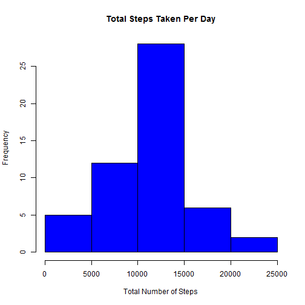
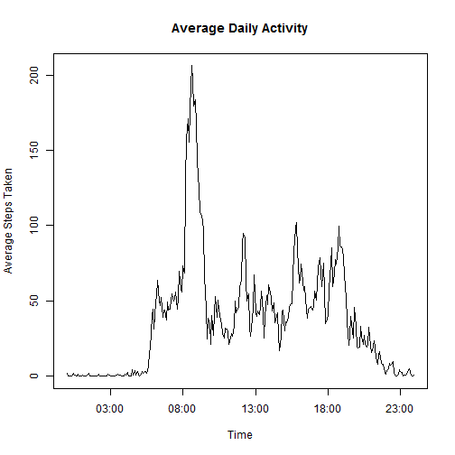
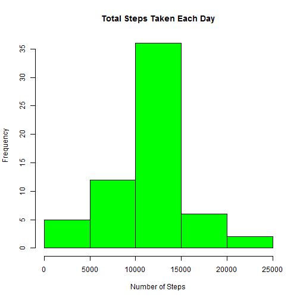
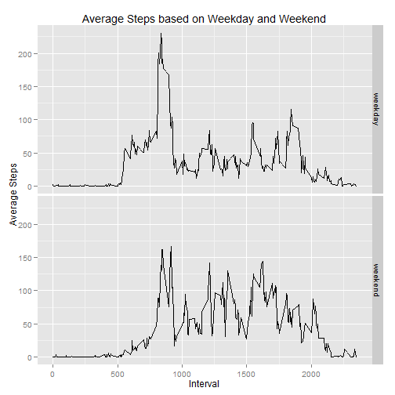

The following R Markdown document includes the information for the Coursera Reproducible Research Assessment 1. 
The assignment makes use of data from a personal activity monitoring device, which collects data at 5 minute intervals through out the day. The data used consists of two months of data from an anonymous source during the months of October and November, 2012 and include the number of steps taken in 5 minute intervals each day. (https://class.coursera.org/repdata-014).


**Part 1: Loading and Preproocessing the data**

Part 1a: Load and process the Activity monitoring data downloaded from the course site.  
         The datasets processed are:
           - original activty data includes:steps (number of steps taken in 5 minute intervals), date, 
             interval (5 minute intervals)  
           - and a dataset is processed to include a date/time stamp used later in the assignment
           - a dataset that eliminates missing data in the original dataset (NAs)


```r
fitdata <- read.csv("./repdata/activity.csv")

t1 <- sprintf("%04d", fitdata$interval)
t2 <- gsub('^(.{2})(.*)$', '\\1:\\2', t1)
dt1 <- paste("2012-10-01", t2, sep = " ")
dt2 <- strptime(dt1, format="%Y-%m-%d %H:%M")
fitdata1 <- cbind(fitdata, dt2)
fitdata1 <- fitdata1[c("steps", "date", "interval", "dt2")]

fitdata2 <- na.omit(fitdata)
```
**Part 2: What is the mean total number of steps taken per day?**

Part 2a: The total number of steps are calculated for the data set without missing values.


```r
library(plyr)
fitdata3 <- ddply(fitdata2, .(date), summarize, totsteps = sum(steps))
```


Part 2b: A histogram of the total number of steps taken per day.


```r
hist(fitdata3$totsteps, col="blue", main = "Total Steps Taken Per Day", xlab="Total Number of Steps")
```

 

Part 2c: The mean and median fo the total number of steps taken per day.


```r
meansteps <- as.integer(mean(fitdata3$totsteps))
mediansteps <- median(fitdata3$totsteps)
```

```
## Mean for the total number of steps take per day:  10766 
##  Median for the total number of steps take per day:  10765
```


**Part 3: What is the average daily activity pattern?**

Part 3a: Plot of the 5-minute interval and the average number of steps taken, averaged across all days.
         * Use the dataset with the datetime (date and interval) stamp.
         * Detemine the average steps taken based on this dataset.
         * Plot the interval and average steps taken.


```r
fitdataDT <- na.omit(fitdata1)
avgdata1 <- ddply(fitdataDT, .(dt2), summarize, meansteps = mean(steps))

plot(avgdata1, xlab="", ylab= "", type = "l") 
title(main = "Average Daily Activity", xlab = "Time", ylab = "Average Steps Taken")
```

 

Part 3b: The maximum number of steps of 5-minute interval, on average across all the days in the dataset.

```r
as.integer(avgdata1[which.max(avgdata1[,2]),2])
```

```
## [1] 206
```


**Part 4: Inputing missing values**

Part 4a: Calculate and report the total number of missing values in the dataset (rows with NA).


```r
numna <- sum(is.na(fitdata))
```

```
## The total number of missing values (NAs):  2304
```


Part 4b: The missing values (NAs) will be filled in filled in with the mean for the corresponding 5-minute interval.

         * Use the mean from the dataset without NA to determine the mean steps per interval.
         * Replaced the calculated mean steps with the missing data of original dataset.
         * Combine the new column without missing data with the original dataset and eliminate the original 'steps'
           column with missing values in the new dataset.
         * Recalculate the total number of steps taken each day with new dataset.
         
Part 4c: Create the new dataset with the missing values filled in, based on the steps from 4b.


```r
meanfitdata <- ddply(fitdata2, .(interval), summarize, meansteps = mean(steps))
meanfitdata$meansteps <- as.integer(meanfitdata$meansteps)
for (i in fitdata$interval) {
   newfitdata <- replace(fitdata$steps, is.na(fitdata$steps), (meanfitdata$meansteps))
}
newfitset <- cbind(fitdata, newfitdata)
colnames(newfitset)[4] <- "revsteps"
newfitset <- newfitset[c("revsteps", "date", "interval")]
totfitset <- ddply(newfitset, .(date), summarize, totsteps2 = sum(revsteps))
```

Part 4d: Histogram of recalculated total number of stpes with new dataset. Determine mean and median total number of steps wit new data.

* Histogram of the total number of steps and taken each day based on new dataset.


```r
hist(totfitset$totsteps2, col="green", main = "Total Steps Taken Each Day", xlab="Number of Steps")
```

 

* Recalculated mean and median with new dataset. Compare to mean and median from original dataset (no NAs).


```r
meansteps2 <- as.integer(mean(totfitset$totsteps2))
mediansteps2 <- median(totfitset$totsteps2)
```

```
##  Mean for the total number of steps take per day for new dataset: 10749 
##  Mean for the total number of steps take per day for original dataset: 10766 
##  Difference in mean: 17 
##  Median for the total number of steps take per day from new dataset: 10641 
##  Median for the total number of steps take per day from original dataset: 10765 
##  Difference in median: 124
```

In comparison the values for mean and median from original values and new values differ only slightly with the new data returning a lower value for both the mean and median.  It may depend on the type of precision requested to determine if the impact is significant.

**Part 5: Are there differences in activity patterns between weekdays and weekends? **

Part 5a: A new factor variable in the dataset with filled in missing values is created with levels 'weekday' and 'weekend'.


```r
newfitset$day <- factor(weekdays(as.Date(newfitset$date)), levels = c('Monday', 'Tuesday', 'Wednesday', 'Thursday', 'Friday', 'Saturday', 'Sunday'))
levels(newfitset$day)[1:5] <- "weekday"
levels(newfitset$day)[2:3] <- "weekend"
newfitset <- newfitset[c("revsteps", "date", "interval", "day")]
newfitset2 <- cbind(newfitset, dt2)
newfitset2 <- newfitset2[c("revsteps", "date", "interval", "day", "dt2")]
```

Part 5b: Determine the the average number of steps taken, averaged across all weekday and weekends, based on the 5-minute inerval. Print the panel plot containing a the 5-minute interval and average number of steps taken. Note that interval was used for x-axis instead of time.


```r
avgdata2 <- ddply(newfitset2, .(interval, day), summarize, avgsteps2 = mean(revsteps))

library(ggplot2)

ggplot(avgdata2, aes(x=interval, y=avgsteps2)
   ) + geom_line() + facet_grid(day ~ .) + xlab("Interval") + ylab("Average Steps"
   ) + ggtitle("Average Steps based on Weekday and Weekend")
```

 

